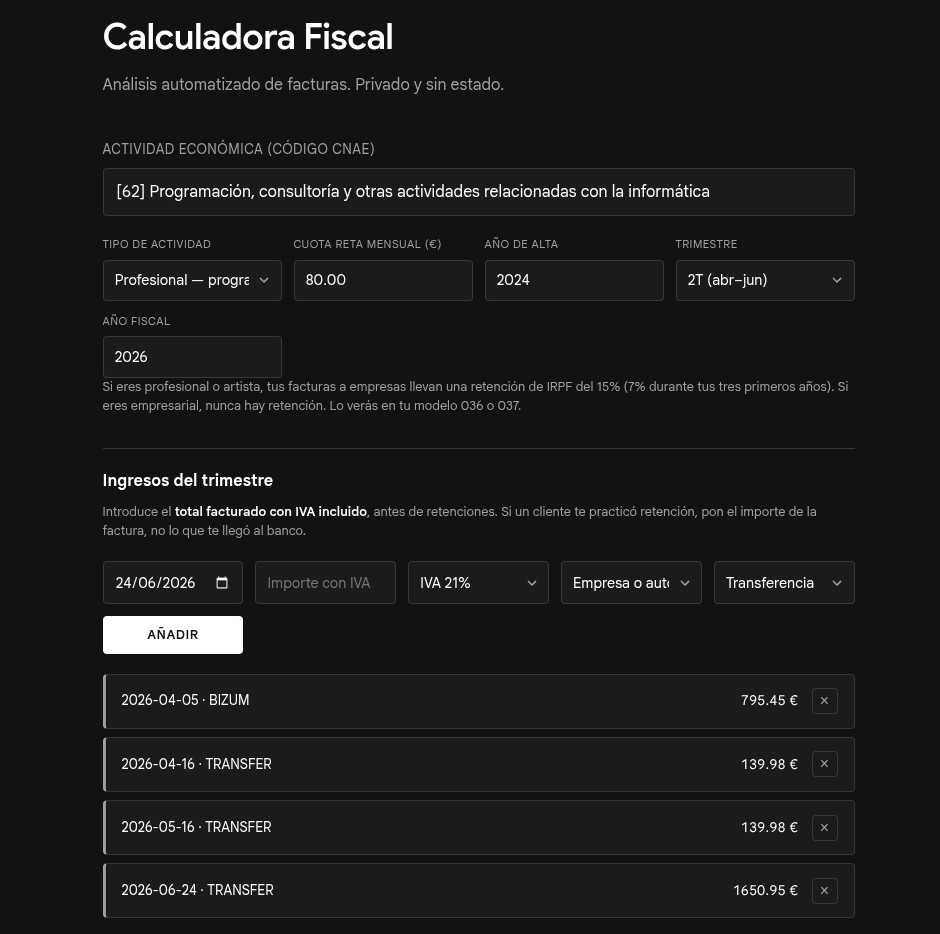
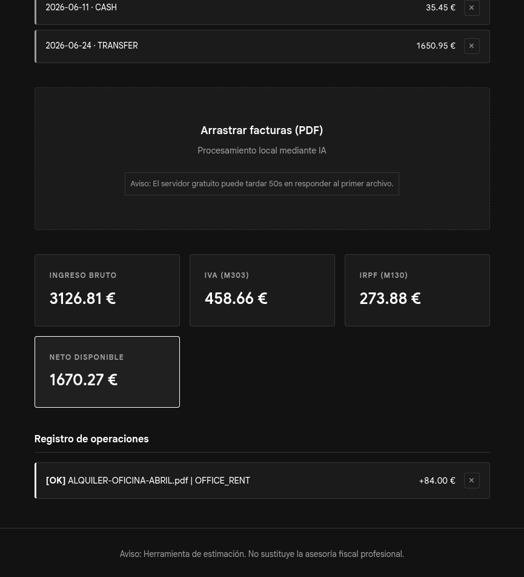
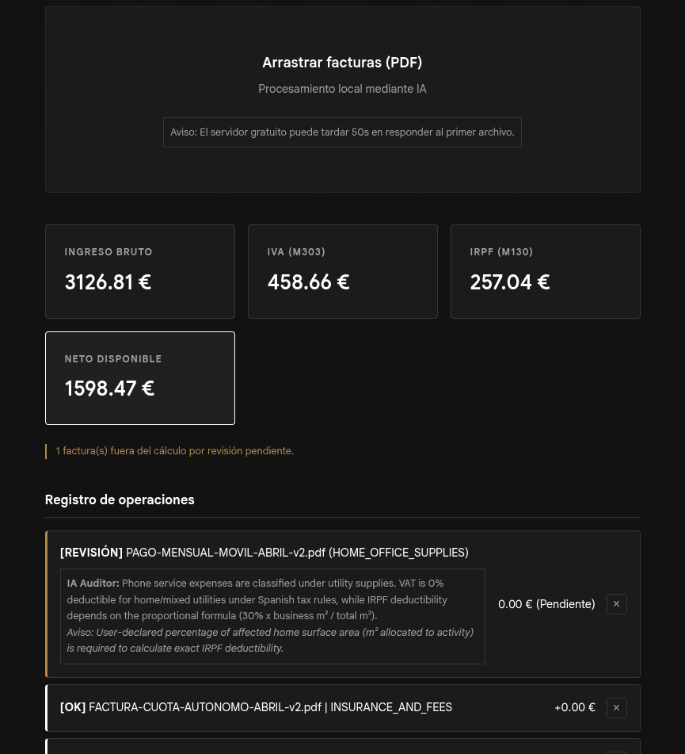
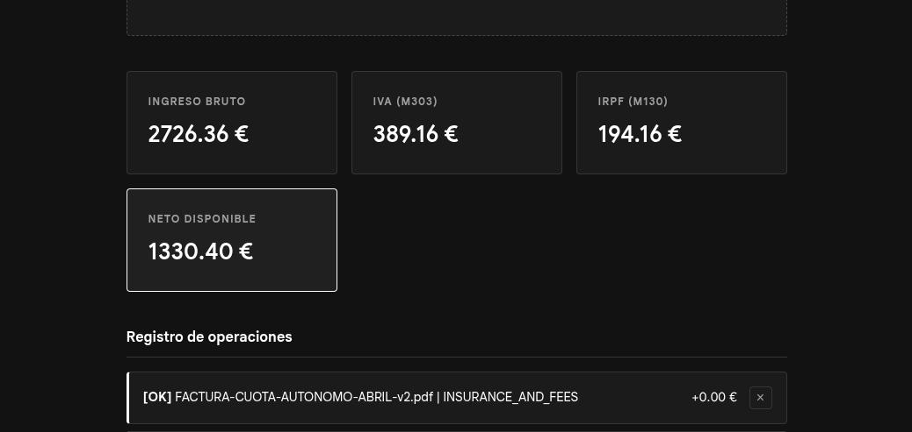

# AutoAccountant

*[Versión en español](README.md)*

> **Work in progress.** The code is finished and runs locally; deployment is still pending. See *Current status* for where everything stands. This note is temporary.

A quarterly tax calculator for self-employed workers in Spain (*autónomos*). It reads expense invoices with an AI model, classifies them against the user's registered business activity, and breaks down how much needs to be set aside for the tax office.

The starting point is simple: billing €30,000 a year doesn't mean taking home €30,000. Between the VAT you collect on the tax office's behalf, the quarterly income tax prepayment and the monthly social security contribution, the gap between what comes in and what stays yours is wide, and it rarely becomes clear until the quarter closes. This app tries to show you that gap before it arrives.



## An honest warning first

I'm a developer, not an accountant. The engineering side is solid work: the tax rules live in Java, the domain is covered by tests (just the one test class so far) and amounts are calculated with exact decimal arithmetic. The tax side is another story.

I built the rules leaning on public documentation, on the open data published at datos.gob.es for the activity classification, and on a fair few hours of reading. But I have no accounting background, and there are calls I made on my best judgement without anyone who actually knows to check them against. I tested with invoices I made up myself.

Put another way: the app does what it says it does, but I can't promise that what it says is exactly what a tax adviser would say. Treat it as an estimate to get a sense of where you stand, never as the basis for a filing.

There are also three known deviations I haven't fixed:

- **The *modelo 130* is calculated per quarter in isolation.** In reality it's cumulative from 1 January: it's worked out on the whole year's earnings so far, minus what you already paid in previous quarters. If your income is steady the difference is small; if it isn't, it isn't.
- **The 5% allowance for hard-to-justify expenses** has an annual €2,000 cap that I split into quarters. The tax office calculates it on the running annual total.
- **Foreign transactions under the reverse charge mechanism** (software subscriptions, intra-EU services) get processed, but the treatment applied to them isn't right. I couldn't find solid legal ground to stand on. Oops.

## Other risks worth knowing about

- **The AI misreads things.** It can get an amount wrong, apply the wrong VAT rate, or file an expense under the wrong category. Every processed invoice should be reviewed. The app flags the ones it isn't sure about, but it won't catch all of its own mistakes. In practice: some company invoices are heavily styled or just a mess to parse, and the model occasionally loses the plot.
- **In cloud mode, your data goes through Google.** The deployed version uses the free tier of the Gemini API, and on that tier Google may use submitted content to improve its models. If you're processing real invoices, run the project locally against your own model — or just feed it an invoice with nothing but numbers on it, no personal details.
- **Direct assessment only.** If you're taxed under the *módulos* system (*estimación objetiva*), the calculation works differently and this won't help you.
- **Careful not to mix up CNAE and IAE codes.** The app searches by CNAE code, the one used by the social security system. If you enter your IAE tax code instead, you'll probably land on an activity that exists but isn't yours, because the numbers happen to overlap between the two catalogues. The result is a calculation that's wrong without telling you. I know because it happened to me and I spent a while fighting it.
- **Nothing is saved.** Close the tab and it's all gone. That's deliberate — which also means there's no history and no way to pick up where you left off.

## How to use it

**1. Find your activity.** The dropdown loads the CNAE 2025 activity list published as open data. Type what you do — "programming", "beauty", "transport" — rather than the number, though searching by number works too.

**2. Fill in your profile.** It needs to know whether your activity is classed as business, professional or artistic, since that's what determines whether your invoices carry withholding tax, plus your monthly social security contribution (*cuota de autónomo*) and the year you registered.

**3. Enter your income.** By hand, one at a time. Most small self-employed workers get paid in cash or by instant transfer and have no PDF to upload, so automating this would have shut out exactly the typical user. One thing that matters: enter the total invoiced with VAT included, before any withholding. If a client withheld tax, enter the invoice amount, not what landed in your account.

**4. Upload your expense invoices.** Drag the PDFs in or click to open the file picker. They're processed one at a time and each result appears below with its status.



**5. Check anything left flagged.** Some expenses can't be settled from an invoice alone: vehicle costs, household utilities, travel meals and client entertainment all depend on information that isn't on the paper. Those invoices stay out of the totals until you confirm them, and the app tells you what it's missing.




**6. Read the result.** The panel shows total billed, what to set aside for VAT, the income tax provision, and what's actually left over.



## How it's built

### Two endpoints, and why only two

```
POST /api/invoices/process    one invoice, multipart
POST /api/quarter/summary     the whole quarter, JSON
```

The first takes a PDF and returns what the AI extracted, with the deduction rules already applied. The second takes the full list of processed invoices plus the manually entered income, and returns the quarter's closing figures.

Two rather than one comes down to there being no database. The server remembers nothing between requests, so the state of the quarter lives in the browser: each response is held in client memory and sent back in full when it's time to calculate. It does sound odd for the amounts to make a round trip, and it is a bit, but it's what makes it possible to promise nothing is stored anywhere. The trade-off is that someone could tamper with those numbers from their browser's dev tools; given they'd only be fooling themselves, that seemed like a fair deal.

### The AI service sits behind an interface

The whole project knows one contract, `InvoiceOcrService`, and nothing else. Who implements it underneath doesn't matter: today it's Gemini, tomorrow it could be a local model via Ollama or any other provider. Wiring in a new implementation is a matter of a `@Profile` annotation.

Being honest, that's the easy part. Writing the new implementation is real work, because every model has its quirks: Gemini takes a PDF directly, whereas local vision models only understand images and you'd have to rasterise the document first; how you guarantee the response comes back as valid JSON changes from provider to provider; and so on. Schema adherence is noticeably worse on smaller models. But all of that stays sealed inside one class, and the rest of the project never finds out.

This decision is also what makes the privacy claim credible. The cloud version sends your invoices to Google; the local version sends them nowhere. Being able to offer both without rewriting anything was exactly the point.

There's no separate frontend project, and that wasn't an oversight. Building the interface with Angular or something similar would have meant spending more time wrestling with the framework than on the problem I actually wanted to solve, which was the tax logic. With plain HTML, CSS and JavaScript the interface came together in an afternoon and I could focus on the part with real substance to it.

Why? Because Spring Boot can serve the static files straight from the jar. I know it isn't the most elegant setup, but this way there's one deployable instead of two: a single cold start on the free tier, a single URL, and in production the frontend and the API share an origin, which takes CORS off the table.

It's a decision I'm not ruling out revisiting. Vue strikes me as the natural next step if the interface ever grows: it can be adopted incrementally, it doesn't force a rewrite from scratch, and the learning curve is a good deal gentler than Angular's. For a single-screen app, it just wasn't worth it yet.

### The AI extracts, it doesn't decide

The model reads the invoice and classifies the expense. The deduction percentages are applied by the backend using fixed rules written in Java, with each category knowing how to resolve its own. That's on purpose: a language model will invent a percentage with complete confidence, and there's real money involved here, estimates or not. When the app has no deterministic rule for a case, it doesn't improvise — it flags it for a human to look at.

The same reasoning is why an invoice with no readable date stays out of the calculation. Every amount on it might be perfect, but with no idea which quarter it belongs to there's no way to count it.

### The model's reasoning comes out in English

It's the most visible oddity in the interface: the app is in Spanish and the model answers in English. The reason is that the prompt is written in English, and that in turn is because models follow long, complex instructions more reliably in that language, and because it keeps the reasoning using exactly the same category names as the code, with no translation step in between to lose precision.

It's debatable and will probably change: there's a Spanish version of the prompt ready to go, and the sensible thing would be to pick one or the other based on the interface language. For now it stays as it is, and that text is aimed more at whoever's reviewing the project than at the end user.

### Decimal arithmetic, not floating point

Amounts are calculated with `BigDecimal` end to end. Using `double` throws the result off by a cent in roughly one invoice in nine hundred, always on amounts whose third decimal lands right on the edge. It's not much, but it's the kind of error that has no defence at all in a tax application.

### Keeping costs down

Requests are rate-limited per IP with Bucket4j, on top of the limits the Gemini API already imposes — because after digging into it a bit, Gemini's limits exist to protect Google's servers, not the people who might use this app once it's deployed. The free quota is finite and it only takes someone dragging in fifty PDFs at once to burn through it. Upload a lot of invoices in quick succession and some will be turned away temporarily.

## Current status

The full cycle works locally: find your activity, set up your profile, enter income, upload invoices, delete them if you got something wrong, and watch the quarter recalculate itself. The domain is covered by tests checking VAT separation on VAT-inclusive amounts, the *modelo 303* and *modelo 130* calculations, quarter filtering, and the case of a quarter that closes at a loss.

Still to do: a bit more input validation on some of the text fields, and deploying to Render, which is next.

Local mode with a self-hosted model is accounted for in the architecture but not implemented. The interface is ready and all that's missing is the class itself (say, `ChatGptServiceImpl` or `OllamaServiceImpl`).

## Configuration

Environment variables:

| Variable | Description |
|---|---|
| `GEMINI_API_KEY` | API key, free from Google AI Studio |
| `GEMINI_API_MODEL` | Which model to use. Worth pinning and keeping out of the code: Google retires models fairly often, and a URL with the name baked into it stops working without warning |
| `APP_CORS_ALLOWED_ORIGINS` | Allowed origins. No need to touch this locally |

The key is never written into the code or committed to the repository.

## Stack

Java with Spring Boot on the backend, and plain HTML, CSS and JavaScript on the frontend, all served as a single application. No database.
