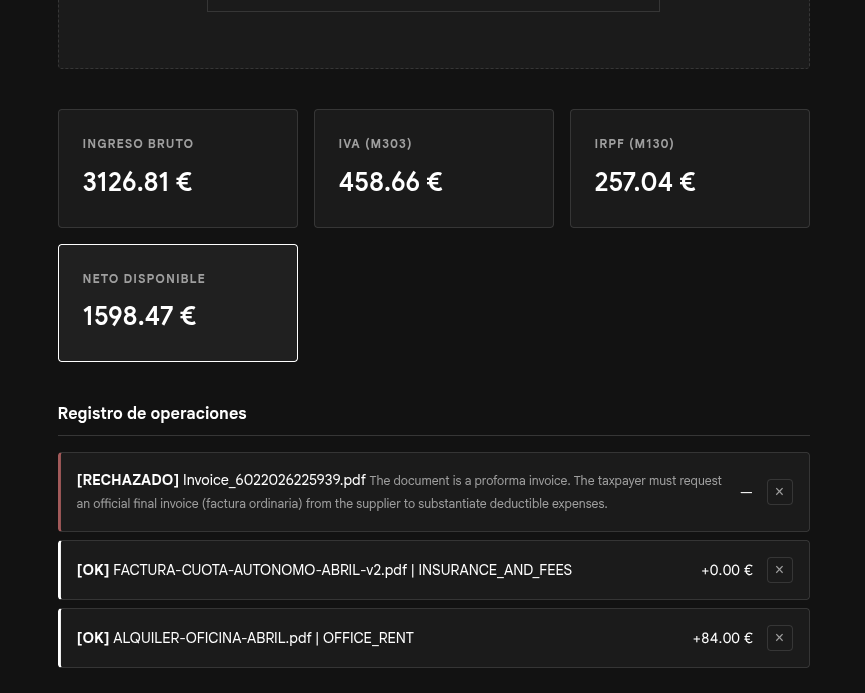

# AutoAccountant

*[English version](README.en.md)*

> **Proyecto en desarrollo.** El código está terminado y funciona en local, faltaría el despliegue en Render. Consulta el apartado *Estado actual* para saber dónde está cada cosa. Esta nota es temporal.

Calculadora fiscal trimestral para autónomos en España. Lee facturas de gasto con un modelo de inteligencia artificial, las clasifica según la actividad económica declarada y desglosa lo que hay que reservar para Hacienda.

La idea de partida es sencilla: quien factura 30.000 euros al año no se lleva 30.000 euros. Entre el IVA que cobra por cuenta de Hacienda, el pago fraccionado del IRPF y la cuota de autónomos, la diferencia entre lo que entra y lo que queda es grande, y no suele quedar clara hasta que llega el trimestre. Esta aplicación intenta enseñar esa diferencia antes de que llegue.


## Aviso sobre la aplicación

Soy programador, no contable. La parte de ingeniería está trabajada: las reglas fiscales viven en Java, el dominio está cubierto con tests (de momento solo hay uno :P) y los importes se calculan con aritmética decimal exacta. La parte fiscal es otra historia.

He construido las reglas apoyándome en documentación pública, en los datos abiertos de [datos.gob.es](https://datos.gob.es/es/) para la clasificación de actividades, y en bastantes horas de lectura. Pero no tengo formación contable, y hay decisiones que he tomado con mi mejor criterio sin poder contrastarlas con alguien que sepa de verdad. Las pruebas las he hecho con facturas inventadas por mí.

Dicho de otro modo: la aplicación hace lo que dice que hace, pero no puedo garantizar que lo que dice sea exactamente lo que diría un asesor fiscal. Trátala como una estimación para hacerte una idea, nunca como la base de una declaración.

Hay además tres desviaciones que conozco y que aún no he resuelto:

- **El modelo 130 se calcula por trimestre aislado.** En realidad es acumulativo desde el 1 de enero: se calcula sobre el rendimiento de todo el año transcurrido y se resta lo ya pagado en trimestres anteriores. Si tus ingresos son estables la diferencia es pequeña; si son irregulares, no.
- **El 5% de gastos de difícil justificación** tiene un tope anual de 2.000 euros que yo reparto a cuartos. Hacienda lo calcula sobre el acumulado.
- **Las operaciones extranjeras con inversión del sujeto pasivo** (suscripciones de software, servicios intracomunitarios) se procesan, pero el tratamiento que se les aplica no es el correcto, no encontraba el recurso legal al que agarrarme, ups.

## Otros riesgos que conviene tener presentes

- **La IA se equivoca leyendo.** Puede confundir un importe, aplicar mal un tipo de IVA o clasificar un gasto donde no toca. Cada factura procesada debería revisarse. La aplicación marca las que le generan dudas, pero no detecta todos sus propios fallos, esto quiere decir, que hay facturas de empresas que estan bastante ofuscadas o son un lío de entender, el modelo de IA a veces se ralla.
- **En modo nube, tus datos pasan por Google.** La versión desplegada usa la capa gratuita de la API de Gemini, y en ese nivel Google puede usar el contenido enviado para mejorar sus modelos. Si vas a procesar facturas reales, ejecuta el proyecto en local contra un modelo propio o simplemente pasale una factura que solamente tenga numeros, nada de información personal.
- **Solo contempla estimación directa.** Si tributas por módulos, el sistema de cálculo es otro y esto no te sirve.
- **Cuidado con confundir CNAE e IAE.** La aplicación busca por código CNAE, que es el de la Seguridad Social. Si introduces tu epígrafe del IAE, es probable que encuentres una actividad que existe pero no es la tuya, porque los números coinciden por casualidad entre ambos catálogos. El resultado será un cálculo silenciosamente equivocado, lo sé porque me ha pasado y me he peleado con esto.
- **No guarda nada.** Al cerrar la pestaña se pierde todo. Es deliberado, es decir, no hay historial ni forma de retomar una sesión.

## Cómo se usa

**1. Busca tu actividad.** El desplegable carga las actividades del CNAE 2025 publicadas como datos abiertos. Escribe lo que haces —"programación", "estética", "transporte"— en lugar del número, aunque también puedes buscar el número.

**2. Completa tu perfil.** Necesita saber si tu actividad es empresarial, profesional o artística, porque eso determina si tus facturas llevan retención, además de la cuota mensual que pagas al RETA (Cuota Autónomo) y el año en que te diste de alta.

**3. Introduce tus ingresos.** A mano, uno a uno. La mayoría de autónomos pequeños cobran en efectivo o por Bizum y no tienen ningún PDF que subir, así que intentar automatizarlo habría dejado fuera precisamente al usuario típico. Un detalle importante: se introduce el total facturado con el IVA incluido, antes de retenciones. Si un cliente te retuvo, va el importe de la factura, no lo que llegó al banco.

**4. Sube las facturas de gasto.** Arrastra los PDF o pulsa para abrir el explorador. Se procesan una a una y cada resultado aparece debajo con su estado.


**5. Revisa lo que quede marcado.** Hay gastos que una factura por sí sola no permite resolver: los de vehículo, los suministros de la vivienda, las dietas o las atenciones a clientes dependen de datos que no están en el papel. Esas facturas se quedan fuera del cálculo hasta que las confirmes, y la aplicación explica qué le falta.




**6. Lee el resultado.** El panel muestra el total facturado, lo que hay que reservar para el IVA, la provisión del IRPF y el dinero que queda realmente disponible.


## Cómo está construido

### Dos endpoints, y por qué solo dos

```
POST /api/invoices/process    una factura, multipart
POST /api/quarter/summary     el trimestre entero, JSON
```

El primero recibe un PDF y devuelve lo que la IA extrajo, con las reglas de deducción ya aplicadas. El segundo recibe la lista completa de facturas procesadas más los ingresos introducidos a mano, y devuelve el cierre del trimestre.

Que sean dos y no uno tiene que ver con la ausencia de base de datos. El servidor no recuerda nada entre peticiones, así que el estado del trimestre vive en el navegador: cada respuesta se guarda en memoria del cliente y se devuelve entera cuando toca calcular. Suena raro que los importes viajen de ida y vuelta, y lo es un poco, pero es lo que permite prometer que no se almacena nada en ningún sitio. Como contrapartida, alguien podría manipular esos números desde las herramientas del navegador; teniendo en cuenta que solo se engañaría a sí mismo, me pareció un intercambio razonable.

### El servicio de IA está detrás de una interfaz

Todo el proyecto conoce un contrato, `InvoiceOcrService`, y nada más. Quién lo implemente por debajo le da igual: hoy es Gemini, mañana podría ser un modelo local con Ollama o cualquier otro proveedor. Conectar una implementación nueva es cuestión de una anotación `@Profile`.

Siendo sincero, esa parte es la "fácil". Escribir la implementación nueva sí da trabajo, porque cada modelo tiene sus manías: Gemini acepta un PDF directamente, mientras que los modelos de visión locales solo entienden imágenes y habría que rasterizar el documento antes; la forma de garantizar que la respuesta llegue como JSON válido cambia según el proveedor y bla bla bla.
La adherencia al esquema es bastante peor en modelos pequeños. Pero todo eso queda encerrado dentro de una clase, y el resto del proyecto ni se entera.

Esta decisión es también la que hace creíble la promesa de privacidad. La versión en la nube manda tus facturas a Google; la versión local no las manda a ninguna parte. Poder ofrecer ambas sin reescribir nada era justamente el objetivo.

No hay un proyecto de frontend aparte, y no es por descuido. Montar la interfaz con Angular o similar habría significado dedicar más tiempo a pelearme con el framework que al problema que quería resolver, que era la lógica fiscal. Con HTML, CSS y JavaScript a secas la interfaz la tuve lista en nada y pude centrarme en lo que de verdad quería enfocarme.

¿Por que? Porque Spring Boot puede servir los archivos estáticos desde el propio jar, se que no es lo mas óptimo, pero de esta manera, hay un único desplegable en lugar de dos: un solo arranque en frío en la capa gratuita, una sola URL, y en producción el frontend y la API comparten origen, con lo que el CORS deja de ser un problema.

Es una decisión que no descarto revisar. Vue me parece la evolución natural si en algún momento me apetece complicar la interfaz, para una aplicación de una sola pantalla, no compensaba complicarme la vida con Angular.

### La IA extrae, pero no decide

El modelo lee la factura y clasifica el gasto. Los porcentajes de deducción los aplica el backend con reglas fijas escritas en Java, y cada categoría sabe resolver la suya. Esto es intencionado: un modelo de lenguaje puede inventarse un porcentaje con toda la seguridad del mundo, y aquí hay dinero de por medio, aunque sea una aplicación de estimaciones. Cuando la aplicación no tiene una regla determinista para un caso, no improvisa: lo marca para que lo mire una persona.

El mismo criterio explica que una factura sin fecha legible no entre en el cálculo. Puede tener todos los importes perfectos, pero sin saber a qué trimestre pertenece no hay forma de contabilizarla.

### El razonamiento del modelo sale en inglés

Es la rareza más visible de la interfaz: la aplicación está en español y el modelo contesta en inglés. La razón es que el prompt está escrito en inglés, y eso a su vez porque los modelos siguen instrucciones largas y complejas de forma más fiable en ese idioma, y porque así el razonamiento usa exactamente los mismos nombres de categoría que el código, sin traducciones intermedias donde se pierda precisión.

Es discutible y probablemente acabe cambiando: existe una versión del prompt en español lista para usar, y lo suyo sería elegir una u otra según el idioma de la interfaz. De momento se queda así, y ese texto va dirigido más a quien revisa el proyecto que al usuario final.

### Aritmética decimal, no coma flotante

Los importes se calculan con `BigDecimal` de punta a punta. Usar `double` desvía un céntimo en aproximadamente una factura de cada novecientas, siempre en los importes cuyo tercer decimal cae justo en el filo. Es poco, pero es la clase de error que en una aplicación fiscal no tiene ninguna defensa posible.

### Contención de costes

Las peticiones están limitadas por IP con Bucket4j, por encima de los límites que ya impone la propia API de Gemini, ya que tras investigar un poco sobre Gemini, sus limites son para proteger los servidores de Google, no los usuarios que pudieran usar esta aplicación una vez desplegada. La cuota gratuita es finita y basta con que alguien arrastre cincuenta PDF seguidos para agotarla. Si subes muchas facturas de golpe, algunas se rechazarán temporalmente.

## Estado actual

El ciclo completo funciona en local: buscar la actividad, configurar el perfil, introducir ingresos, subir facturas, eliminarlas si te has equivocado y ver el trimestre recalcularse solo. El dominio está cubierto con tests que verifican la separación del IVA sobre importes con impuesto incluido, el cálculo del 303 y del 130, el filtrado por trimestre y el caso de un trimestre en pérdidas.

Falta alguna que otra comprobacion de contenido en algun textfield y el despliegue en Render, que es lo siguiente.

El modo local con un modelo propio está contemplado en la arquitectura pero sin implementar. La interfaz está preparada y solamente falta escribir la clase, (por ejemplo: ChatGptServiceImpl, OllamaServiceImpl)

## Configuración

Variables de entorno:

| Variable | Descripción |
|---|---|
| `GEMINI_API_KEY` | Clave de la API, se obtiene gratis en Google AI Studio |
| `GEMINI_API_MODEL` | Modelo a usar. Conviene fijarlo y tenerlo fuera del código: Google retira modelos con cierta frecuencia y una URL con el nombre dentro deja de funcionar sin aviso |
| `APP_CORS_ALLOWED_ORIGINS` | Orígenes permitidos. En local no hace falta tocarlo |

La clave nunca se escribe en el código ni se sube al repositorio.

## Stack

Java con Spring Boot en el backend con Bucket4j para la limitación de peticiones, HTML, CSS y JavaScript sin frameworks en el frontend, servido todo como una sola aplicación. Sin base de datos.
